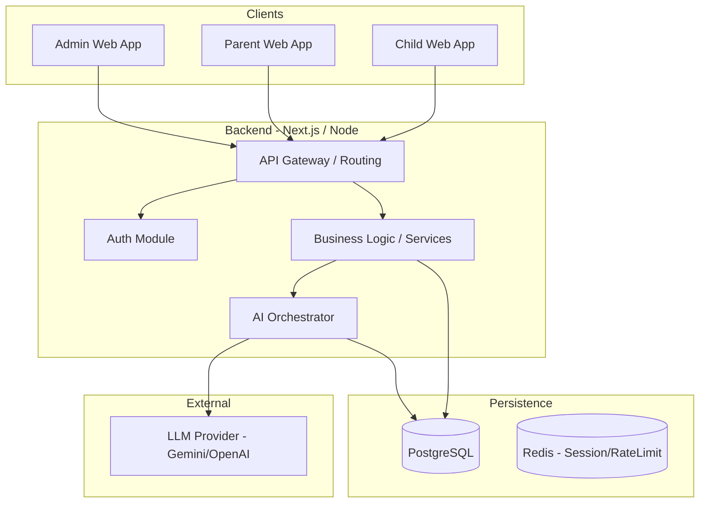
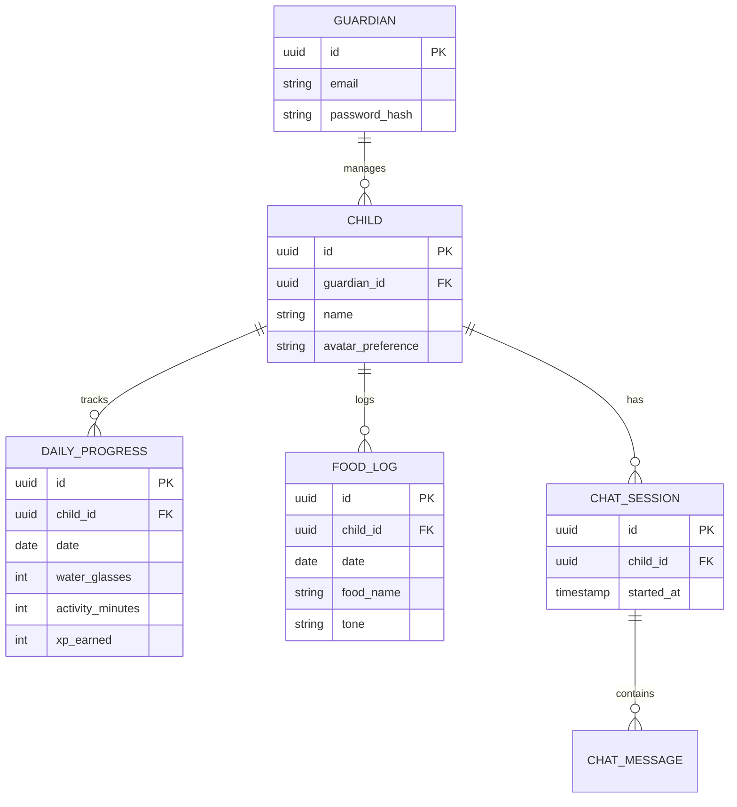

# Si Cehat - Full Platform Architecture Report

## 1. Executive Summary
Si Cehat is an AI-powered educational health companion prototype targeting children aged 8-12, designed to encourage healthy habits (hydration, food, activity) and assist parents with monitoring via a parent dashboard. Currently built as a Next.js App Router prototype relying entirely on `localStorage`, it needs to transition into a scalable platform architecture. 

This document proposes a **Modular Monolith architecture** (given the MVP nature, microservices are unnecessary) with PostgreSQL for persistence, structured AI orchestrator patterns with strict safety guardrails, and role-based access to securely manage children’s interactions and generate anonymized research data.

## 2. Repository Findings
- **Observed**: Next.js App Router setup with routes `/avatar`, `/child`, `/chat`, and `/parent`.
- **Observed**: State is managed via `localStorage` (schemas defined in `src/lib/progress.ts` and `src/lib/avatar.ts`).
- **Observed**: AI constraints defined as a system prompt in `src/lib/chat.ts`, restricting the AI to educational responses (max 5 short sentences) and forbidding medical diagnoses.
- **Observed**: Zod is used for data validation (`chatMessageSchema`, `progressSchema`).
- **Inferred**: No current authentication system exists; users act pseudo-anonymously per browser session.
- **Recommended**: Migration from client-side state storage to a backend relational database to support cross-device access and multi-user parent dashboards.

## 3. Product Capability Map
- **Child Experience**: Onboarding, avatar selection (Default, Apple, Broccoli, Carrot), chat with AI, daily challenges, daily quizzes, food/water/activity logging, and rewards progression.
- **Parent Experience**: Summary dashboard of child's habits, activity tracking, health quiz progress, menu/recipe recommendations.
- **Admin Experience (Inferred/Recommended)**: Dashboard for monitoring active users, managing AI prompts and models, system health monitoring, safety event logging, and exporting anonymized research data.

## 4. System Architecture
We recommend a modular monolith architecture for the MVP, extending the current Next.js application into a full-stack solution.

### 16. System Architecture Diagram


## 5. Backend Architecture
- **Authentication**: JWT/Session-based auth. Children accounts should be linked under a Parent/Guardian account.
- **Modules**:
  - `Users` (Guardians, Children profiles)
  - `Tracking` (Water, Food, Activity, XP, Missions)
  - `AI Communications` (Chat sessions, message history)
  - `Admin` (System monitoring, analytics, content management)
- **Deployment**: Monolithic deployment on Vercel or a simple Docker container on a PaaS (e.g., Render, Railway) to keep MVP costs low.

## 6. Database Architecture
We recommend a PostgreSQL database to handle relationships and enforce data integrity.
**Core Tables:**
- **User Data**: `guardians`, `children`
- **Reference Data**: `mascots`, `challenges`, `quizzes`
- **Behavioral Data**: `water_logs`, `food_logs`, `activity_logs`, `daily_progress`
- **AI Data**: `chat_sessions`, `chat_messages`
- **Admin Data**: `admin_users`, `audit_logs`

### 15. ERD (Entity Relationship Diagram)


## 7. AI Architecture
- **AI Orchestrator**: The backend `/api/chat` endpoint must act as an orchestrator. It injects the system prompt, handles user context, and ensures safety validation before and after the LLM call.
- **Tool Calling**: Functions like `log_water(amount)` and `log_food(item)` should be registered with the LLM so it can execute them server-side, returning the result to the user.

## 8. Admin Portal Architecture
- **Capabilities**: View aggregated user statistics, monitor AI errors/latency, manage system prompts/versions, and extract anonymized datasets for research.
- **Pages**: `/admin/dashboard`, `/admin/users`, `/admin/ai-config`, `/admin/exports`.

## 9. Analytics Architecture
- **Events**: Track `session_start`, `message_sent`, `water_logged`, `quiz_completed`.
- **Aggregation**: Backend cron jobs or materialized views in Postgres to aggregate daily activity per child without exposing raw data to the dashboard unnecessarily.

## 10. Research Data Architecture
- **Operational Data**: Stored normally in Postgres.
- **Research Dataset**: An automated ETL script that runs daily, stripping PII (names, exact timestamps), hashing `child_id`s, and exporting to a secure, separate database or CSV format for researchers. (REQUIRES PRIVACY REVIEW).

## 11. Authentication & RBAC
- **Child**: Passwordless PIN or simple token login managed by the Parent.
- **Parent/Guardian**: Standard Email/Password or OAuth.
- **Admin**: Strict SSO/MFA required.
- **Researcher**: Read-only access to anonymized views only.

## 12. Privacy & Safety (Ages 8-12)
- **Input Filtering**: Reject explicit language or PII insertion.
- **Medical Boundary**: The prompt strictly forbids diagnosis. Responses must default to: "Saya tidak bisa mendiagnosis. Tanyakan pada orang tuamu atau dokter."
- **COPPA/Data Privacy**: Strict minimal data collection. Dummy data should be used for the immediate MVP until consent workflows are approved. (REQUIRES LEGAL REVIEW).

## 13. Monitoring & Audit
- **Audit Logs**: Any change to AI prompts, model versions, or admin access must be logged (`actor`, `action`, `target`, `timestamp`).
- **Monitoring**: Track LLM API latency, error rates, and fallback triggers.

## 14. Data Flows
**Flow: Child logs water via Chat**
1. Child types "Aku minum 2 gelas air."
2. Frontend sends message to `POST /api/chat`.
3. AI Orchestrator appends system context and sends to LLM.
4. LLM triggers tool `log_water({ amount: 2 })`.
5. Backend executes DB insert into `water_logs`.
6. Backend calculates XP and updates `daily_progress`.
7. LLM generates friendly response: "Hebat! Aku sudah catat 2 gelas air putihmu."
8. Frontend updates UI with new message and XP progress.

## 17. API Specification (Examples)
```text
POST /api/chat
Auth: Child session
Input: { "messages": [{ "role": "user", "content": "..." }] }
Output: { "role": "assistant", "content": "..." }

POST /api/children/:id/water
Auth: Child session
Input: { "amount": number }
Output: { "success": true, "xpEarned": number, "totalWater": number }

GET /api/parent/summary/:childId
Auth: Guardian session
Output: { "waterPercent": number, "activityPercent": number, "foodLogs": [...] }
```

## 18. Frontend → Backend Mapping
- **`src/lib/progress.ts`** -> Migrates to `DAILY_PROGRESS` and `FOOD_LOG` tables.
- **`src/lib/avatar.ts`** -> Migrates to `CHILD` table as `avatar_preference`.
- **`src/app/api/chat`** -> Extends to include LLM tool execution and DB persistence.

## 19. Mock Data → Persistent Data
- Currently hardcoded `todayChallenge`, `dailyQuiz`, and `recommendedMenus` in `progress.ts` should be moved to PostgreSQL tables (`challenges`, `quizzes`, `menus`) manageable via the Admin Portal.
- Local Storage keys (`si-cehat-progress`, `si-cehat-avatar`) will be replaced by API fetches utilizing the auth session.

## 20. MVP vs Future
- **MVP (Now)**: Next.js modular monolith, PostgreSQL, simple Parent/Child auth, Gemini/OpenAI integration with tool calling, basic research data export.
- **Future (Phase 2)**: Push notifications (reminders), advanced analytics warehouse, complex RBAC, integration with school/clinic systems (Out of scope for MVP).

## 21. Resolved Questions
- **Consent Flow**: Decision deferred for now. We will build the platform with the assumption that consent handling will be added later before entering the active research phase.
- **Hosting**: The MVP will be **deployed to the web**. This requires us to implement robust authentication (e.g., NextAuth/Auth.js) and a secure remote PostgreSQL database (e.g., Supabase or Neon).
- **AI Provider**: We will build an **AI Provider Abstraction** layer in the orchestrator to seamlessly support multiple providers (e.g., Gemini, Groq, OpenAI) depending on latency, cost, and availability.

## 22. Implementation Roadmap
1. **Phase 1: Database & Auth Setup** - Initialize PostgreSQL, Prisma/Drizzle ORM, and set up Guardian/Child auth flows.
2. **Phase 2: Data Migration** - Move `localStorage` logic into backend API routes for tracking and progress.
3. **Phase 3: AI Orchestrator** - Enhance `/api/chat` to include function calling (tools) and server-side state persistence.
4. **Phase 4: Admin Portal** - Build basic admin views for system health and research data export.
